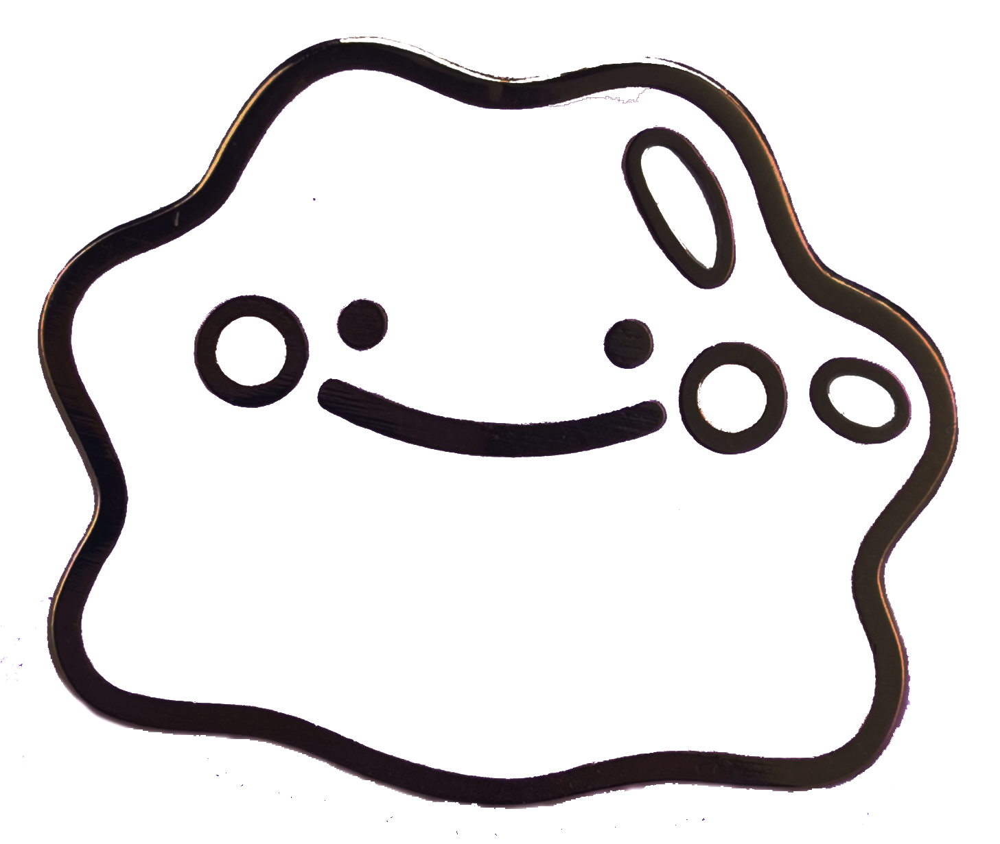

# **Even if your phone is turned off or the battery appears to be dead, it may still be communicating with wireless networks.**

From time to time you may want to disconnect from the network to protect your privacy. Here are a few reasons that come to mind:

- Your ex/spouse/stalker is tracking your location or recording audio.
- You’re going somewhere (maternity store, gay bar, protest march, etc.) and you don’t want your location history in a database that can be queried by advertisers & cops. 
- You're seeking reproductive healthcare or gender-affirming care in an unfriendly environment, or helping someone else who may be at risk.

In this workshop you’ll make a one-time-use Faraday shield for your phone using aluminum foil, paper, and tape. With practice, you can make one in less than 5 minutes.

A Faraday shield is an enclosure made of a conductive material that can attenuate (lessen) or block electromagnetic fields. Typically, several layers of conductive and non-conductive material are used to get better isolation. You'll be using aluminum foil for the conductive layers and paper for the non-conductive layers. 

While your phone is inside a Faraday shield, it should be completely isolated from wireless communications: cell network, wi-fi, and Bluetooth. NFC (near-field communication, used for payments) is probably blocked too. If someone texts you, the message will show up on their phone as “not received.” If someone calls you, it will go straight to voicemail. If you try using the “find my phone” feature from a computer, the last location on the map will be wherever you put your phone into a Faraday shield.

At the end of the workshop you’ll unwrap your phone and destroy your Faraday shield. And you’ll be ready to make one quickly when you need to.

This Faraday shield design is one-time-use because we aren’t confident a reusable design would work reliably. Getting a tight enough seal would be difficult, and aluminum foil will tear when bent repeatedly. You’re free to experiment with reusable designs, but don’t blame us if something goes wrong.

Also, carrying a pre-made Faraday shield in your bag may make people think you’re up to no good. Whereas foil, paper, and tape on their own shouldn’t raise any eyebrows.

If you're interested in why it's difficult to make a good Faraday shield, we recommend the article "Testing Phone-Sized Faraday Bags" by Matt Blaze. Thanks to Nelson for sharing it!
https://www.mattblaze.org/blog/faraday

## Think it through

If you're concerned about location and/or audio surveillance, plan A should be to leave your phone at home. But people have complicated schedules and living situations, and getting home isn't always an option.

Another reason to have a phone nearby, despite the possible risk, is that you may want to be able to call for help in an emergency. There was a time when there were payphones everywhere, but those days are behind us.

Think it through and do what makes sense for y'all. Here's the general routine:

1. Turn off your phone or let the battery run down. You should be in an innocuous place like home, work, or a coffee shop. Definitely not at/near the place where you're planning to do something private.

2. Put your phone into your Faraday shield and close it securely.

3. *Optional precaution pt 1:* Walk/take the bus somewhere low-key and hide your shielded phone. Perhaps under a rock or behind a dumpster.

4. Walk/take the bus to wherever you're doing something private.

5. *Optional precaution pt. 2:* Go back and retrieve your phone, still in the Faraday shield.

6. When you're in an innocuous place, remove your phone from the Faraday shield and turn it on.

Important tip: If you only turn off your phone when you're doing private stuff, you'll leave a record of all the times you're trying to be private. If you can, turn your phone off or let it die for an hour a few times a week.

## What you’ll need

- **aluminum foil**   
  We like this pre-cut foil from the dollar store, but any kind will work.
  
  

- **paper**   
  We're using construction paper because it looks better in photos. Printer paper or newspaper should work fine too.
  
  

- **tape**   
  You can use any kind of tape.
  
  
  
  

- **disc magnets (optional)**   
  If you want, you can put magnets on your Faraday shield so it will stick to metal surfaces.
  
   

## Make your Faraday shield

For this workshop you can keep leave your phone on while it’s inside the Faraday shield. In any other situation you’d want to turn it off first.

❏ Wrap a sheet of paper snugly around your phone and tape it together.

&nbsp;

❏ Fold the ends of the paper into points, fold them inward, and tape them down. Just like wrapping a present.

&nbsp;

❏ Wrap a piece of aluminum foil around your phone. Fold the ends of the aluminum foil into points, fold them inward, and tape them down.

&nbsp;

❏ Wrap your in-progress Faraday shield in another layer of paper and tape it up like a present.

&nbsp;

❏ Apply another layer of foil, using tape to keep the edges sealed.

&nbsp;

❏ Apply another layer of paper with tape.

&nbsp;

❏ Apply a layer of foil with tape.

&nbsp;

❏ Apply a layer of paper with tape. Add magnets and tape them down (optional).&nbsp;

❏ We added another layer of paper and wrote “Luv u!” to make it look cute.

 

❏ If you're with a friend, have them send you some text messages and call your phone. If they can't get through, that means your Faraday shield is working.

❏ If you're using magnets, try sticking your phone + Faraday shield to a metal surface. 

❏ When you're done, tear open your Faraday cage and retrieve your phone.

 

You just made a Faraday shield with three layers of foil alternating with paper. For added security in the future, you can keep adding more layers of foil and paper.

 
 
 
 
 
 
 
 
 
 
 
 
 

**Anti-copyright 2023**

**iffybooks.net/diy-faraday-shield**

 
 

**Iffy Books**&nbsp;

**319 N. 11th St. #2I, PHL**
